# Chat-AI-Agent-Text-to-Image-Convertor

# 🎨 DreamWeaver AI (n8n + OpenRouter + Hugging Face + Cloud Storage + Google Sheets)

An intelligent AI Image Generator built using n8n, OpenRouter API, Hugging Face (Stable Diffusion XL), Cloudflare R2 storage, and Google Sheets.
This system takes text prompts from users, generates high-quality images, and logs everything — securely and automatically. 🚀🖼️

## 🔧 Tech Stack

🤖 AI Agent: OpenRouter API

🎛️ Workflow Automation: n8n (self-hosted)

🎨 Image Generation Model: Hugging Face (Stable Diffusion XL)

☁️ Cloud Storage: Cloudflare R2 (S3-compatible)

## ▶️ Live Demo

   [Watch Live Demo](https://drive.google.com/file/d/1L0yxPjot0pwITT5vWyJDAKxhW0RYHIVx/view?usp=drive_link)

## System Architecture

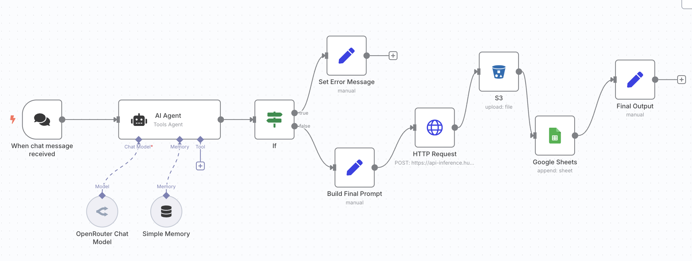

# 📊 Data Logging: Google Sheets

# 🖥️ Presentation: Prezi Interactive Presentation

https://prezi.com/view/A7Imv7mCvR6HrUwFmItS/

## 🚀 Features

✅ Prompt Validation: Only processes valid visual prompts

✅ Prompt Enhancement: Adds styles like "hyperrealistic, soft lighting" automatically

✅ AI Image Generation: Powered by Stable Diffusion XL

✅ Cloud Storage Upload: Images saved securely to S3-compatible storage

✅ Google Sheets Logging: Saves prompt + image URL for traceability

✅ Error Handling: Friendly messages for invalid prompts

✅ Fully Modular Design: Easy to expand or integrate

## 🧠 How It Works

✅ User Input: User types a prompt into n8n chat agent.

✅ Prompt Validation: AI Agent checks if the prompt is visual.

Simple Memeory: Simple Memory node enhances the chatbot's conversational experience by retaining the last few user interactions within a session

✅ Prompt Enhancement: Raw prompt is transformed to improve image quality.

✅ API Call: Enhanced prompt sent to Hugging Face to generate an image.

✅ Cloud Upload: Generated image uploaded to Cloudflare R2.

✅ Google Sheets Logging: Final prompt and image URL logged automatically.

✅ Output: User receives a direct link to their AI-generated image.

## 📈 Performance Metrics

## Metric

- Average Image Generation - ~6–8 seconds
- S3 Upload Time - ~1–2 seconds
- Google Sheets Logging - ~1 second
- End-to-End Workflow Completion ~10–12 seconds

## 📄 Key Nodes Summary

### 🔧 AI Agent Node:

Validates user input and ensures only visual prompts are processed.

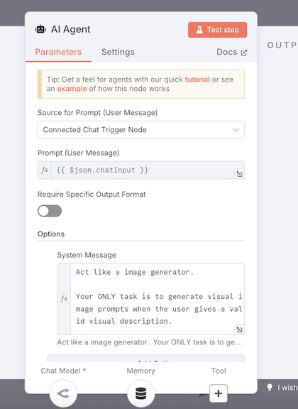

### 🎨 Build Final Prompt Node:

Enhances raw prompts into rich, artistic styles automatically.

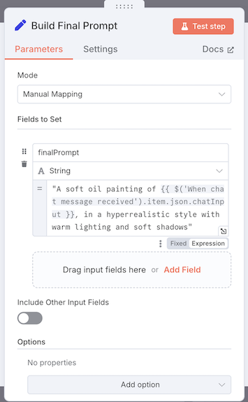

### 🎨 Simple Memory Node:

Enhances the chatbot's conversational experience by retaining the last few user interactions within a session

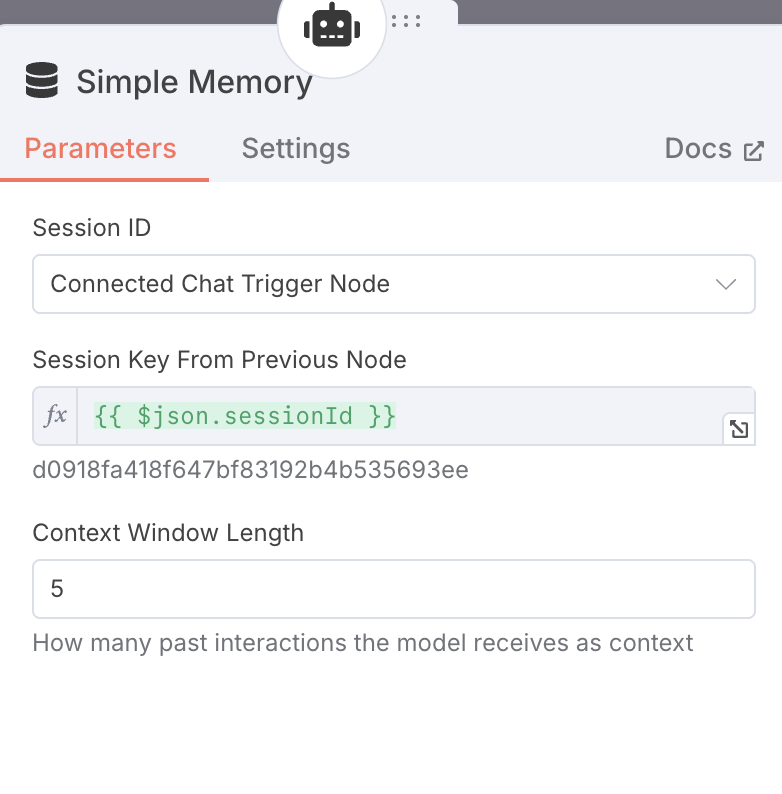

### 🌐 HTTP Request Node:

Sends prompts to Hugging Face for image generation.

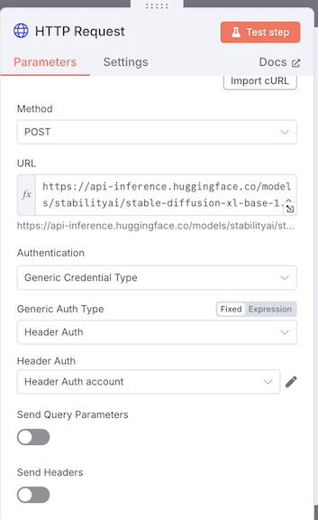

### 📦 S3 Node:

Uploads generated images with dynamic timestamped filenames.

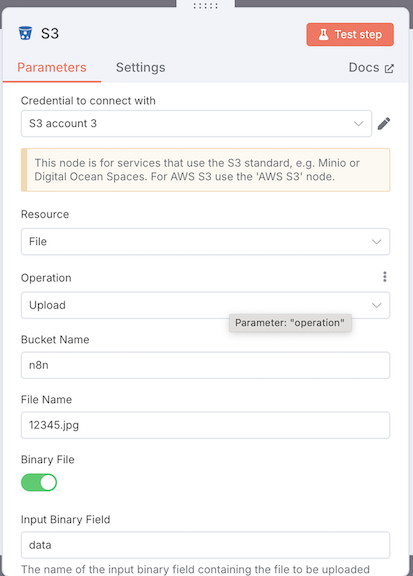

### 📊 Google Sheets Node:

Logs prompt and public image URL for future access and analysis.

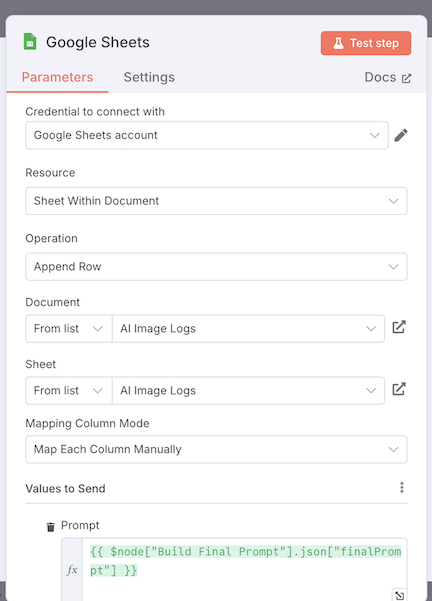

## 🧠 Prompt Engineering Strategies

✅ System role-enforcement: AI acts only as an image generator.

✅ Fallback messaging for invalid prompts.

✅ Style augmentation ("hyperrealistic style with warm lighting") for better images.

## 🧠 Lessons Learned

- Mastered building modular low-code AI workflows with n8n.

- Improved understanding of prompt engineering impacts on outputs.

- Implemented secure, authenticated API interactions.

- Developed strong ethical AI deployment practices.

## 🚧 System Limitations & Improvements

✅ Limitation

- No manual style selection

- Rating Collection

- Analytics Dashboard

✅ Future Improvement

- Add image style presets for users

- Ask the user to rate the output (1–5 stars) to collect valuable training signals

- Develop a visual dashboard (via Looker Studio or Google Sheets Charts) to track prompts trends, styles used, and average ratings

# 📱 WhatsApp AI Chatbot (n8n + OpenAI + Simple Memory + GCP)

An intelligent AI Chatbot system built using n8n, OpenAI GPT models, WhatsApp Business API, and Google Cloud Platform (GCP).  
This project allows users to interact with an AI agent via WhatsApp — in real-time, with context retention, secure HTTPS access, and modular design. 🚀🤖

---

## 🔧 Tech Stack

🤖 AI Agent - OpenAI GPT model
🧠 Memory - Simple Memory (session context)
🔗 Automation Platform - n8n (self-hosted on Docker)
☁️ Cloud Hosting - Google Cloud Platform (GCP VM)
📞 Messaging API - WhatsApp Business Cloud API
🌐 Domain + SSL - DuckDNS domain + SSL certificates (Let's Encrypt)

---

## 🛠 System Architecture Diagram

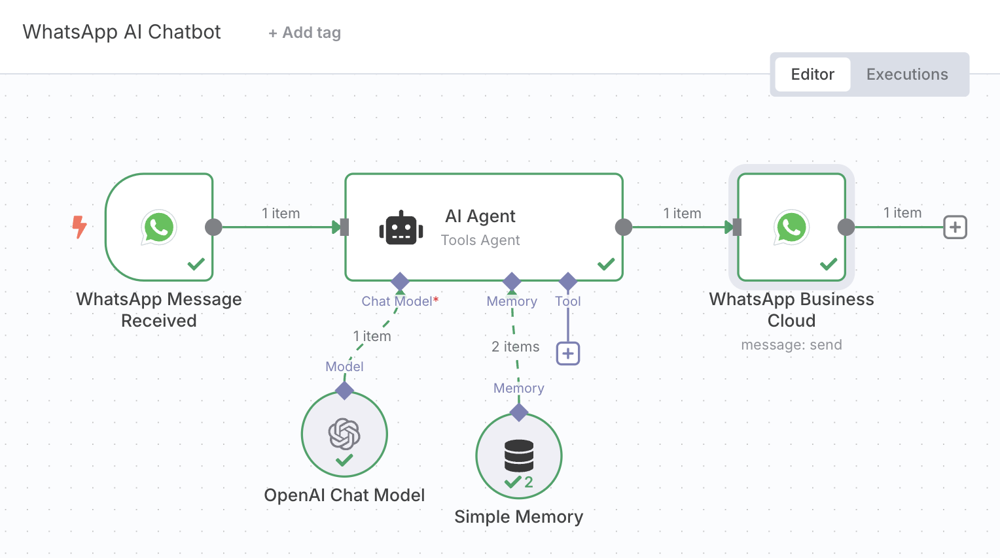

---

## 🚀 Features

✅ Real-time WhatsApp chat handling  
✅ AI-powered responses using OpenAI  
✅ Context retention (remembers last 5 messages)  
✅ Secure HTTPS access via SSL certificates  
✅ Lightweight and fast (responds within 1–2 seconds)  
✅ Cloud-deployed and production-ready  
✅ Error handling for expired tokens and connection failures  
✅ Modular and scalable design

---

## 📈 Workflow

1. User sends a text message on WhatsApp 📲
2. `WhatsApp Message Received` Node triggers
3. Message passed to `AI Agent` Node (powered by OpenAI + Memory)
4. Response generated and sent back via `WhatsApp Business Cloud` Node
5. Optional session memory updated for context tracking

---

## 📊 Key Node Details

### 1. WhatsApp Message Received (Trigger Node)

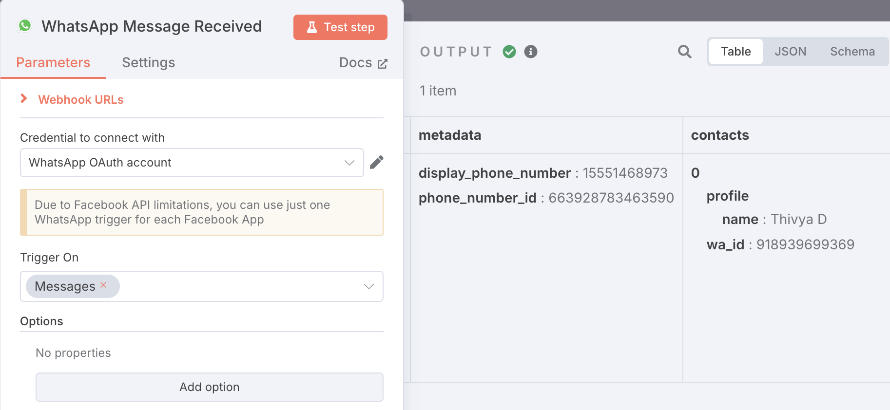

- Captures incoming WhatsApp messages using webhook.
- Connected via WhatsApp Business Cloud API.

### 2. AI Agent (Tools Agent Node)

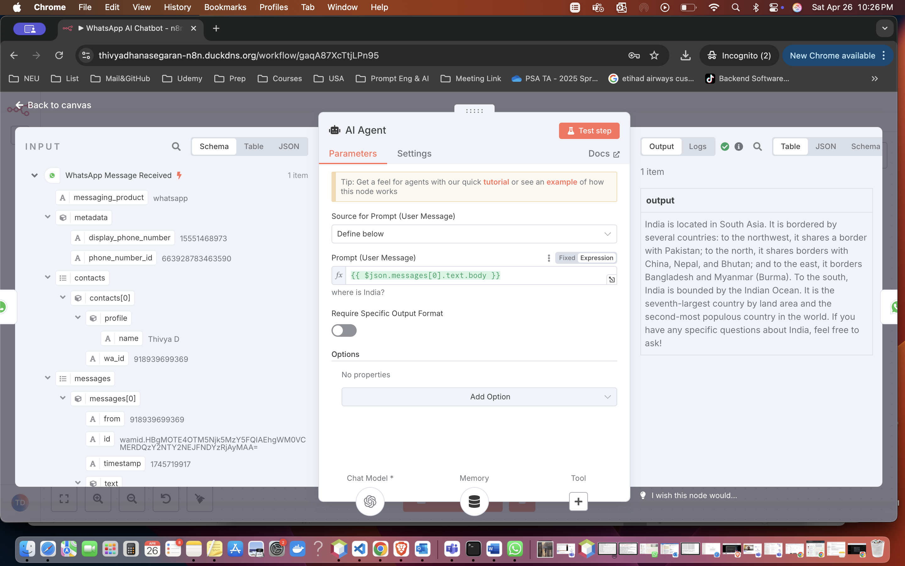

- Processes user input with OpenAI Chat Model.
- Enforces structured, factual responses.
- Incorporates Simple Memory for short-term context.

### 3. Simple Memory

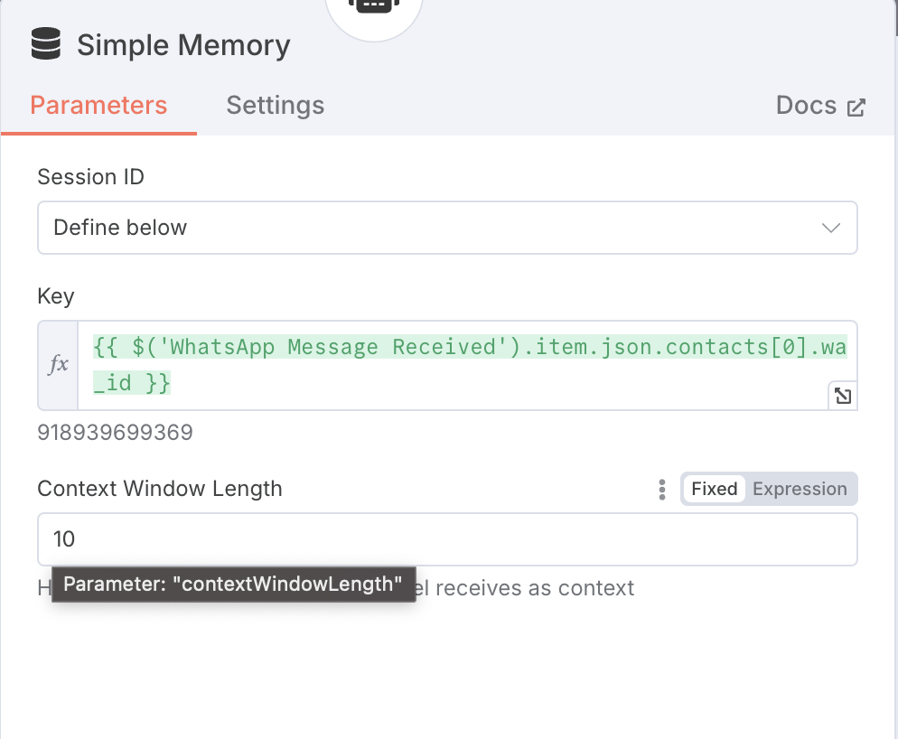

- Remembers last 5 interactions.
- Makes the chatbot feel natural and conversational.

### 4. WhatsApp Business Cloud (Send Message Node)

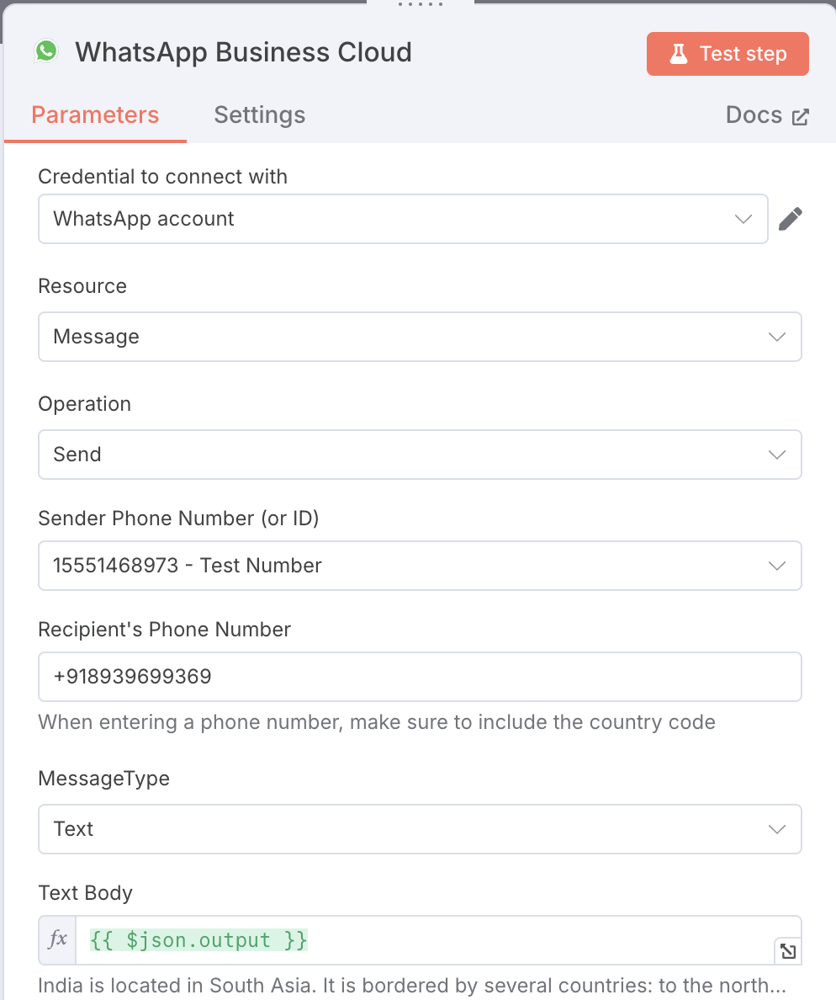

- Sends AI responses back to the user's WhatsApp number.
- Uses secure HTTPS connections.

---

## 🌍 Hosting & Deployment

🖥️ Cloud - Google Cloud Platform (GCP VM)  
 🐳 Docker - n8n installed via Docker  
 🌐 Domain - DuckDNS custom domain (e.g., `thivyadhanasegaran-n8n.duckdns.org`)
🔒 SSL - SSL certificates installed (Let's Encrypt + Certbot)  
 🛡️ Security - Fully HTTPS protected for production use

---

## ⚡ Implementation Highlights

- API: WhatsApp Business API for messaging
- AI Model: OpenAI GPT-3.5 model integration
- Storage: Lightweight RAM-based session memory
- Error Handling: Automatic fallback for expired tokens or timeouts
- Optimized: Only text messaging currently (no media yet) to reduce API cost

---

## 💬 Prompt Engineering Strategy

- Strong instruction prompting to avoid hallucinations
- Factual, polite, and context-aware responses
- Sample prompts handled:
  - "Tell me a motivational quote"
  - "Suggest a book for AI beginners"
  - "Summarize today's weather news"

---

## 📈 Performance Metrics

Text Response Generation - ~1–2 seconds  
 Memory Update - ~500ms  
 Message Delivery to WhatsApp - ~1 second

---

## 🧠 Lessons Learned

- Built real-world conversational AI bots using low-code automation
- Mastered prompt engineering strategies
- Implemented secure API connection practices (SSL, webhook configuration)
- Understood scalable cloud deployments using GCP and Docker
- Practiced ethical considerations in AI communication

---

## 🚧 Challenges & Solutions

Token expiration issues - Plan to implement auto-refresh token system
SSL certificate renewal - Automated using Certbot  
 Connection timeout (curl_error 28) - Fixed webhook access and SSL configs

---

## 🔮 Future Improvements

- Add support for image, video, and voice media messaging
- Automatically store media files to S3 buckets
- Build a Google Sheets analytics dashboard
- Enable multi-language chatbot support (Tamil, Hindi, English)
- Implement smarter fallback for complex queries

---

## 📜 Ethical Considerations

- Full transparency with users that they are interacting with AI
- Bias mitigation through careful prompt engineering
- Respect for user data privacy — no personally identifiable information stored

---

## 🚀 Conclusion

This project successfully implements a practical and usable Generative AI system that transforms user input into AI-powered responses over WhatsApp. It brings together prompt engineering, AI model integration, cloud automation, and secure messaging into one seamless low-code workflow.
The system is modular, scalable, and serves as a strong foundation for expanding into areas like media message processing, analytics-based optimization, and advanced fine-tuning pipelines.
For deployment, I hosted the entire system on Google Cloud Platform (GCP), configured n8n in a Docker environment, and secured it with SSL certificates for HTTPS access. I also purchased a custom domain name to ensure professional and secure endpoint exposure.
Currently, due to API token cost limits and usage constraints, this chatbot is focused on text-based interactions. However, future upgrades are planned to support media files — including voice messages, image uploads, and image analysis, with storage integration to S3 buckets and structured logging into Google Sheets.

Overall, this project demonstrates critical concepts of real-world AI deployment:
• Input validation and secure output handling.
• Cloud hosting and scalable deployment practices.
• Secure communication using SSL and domain management.
• Ethical considerations in AI system building.
It shows how modern AI services can be built with cloud platforms, API integration, automation tools like n8n, and minimal custom coding — making it a real-world, production-grade AI chatbot system ready for further expansion.

---

## 📝 Author

Thivya Dhanasegaran
